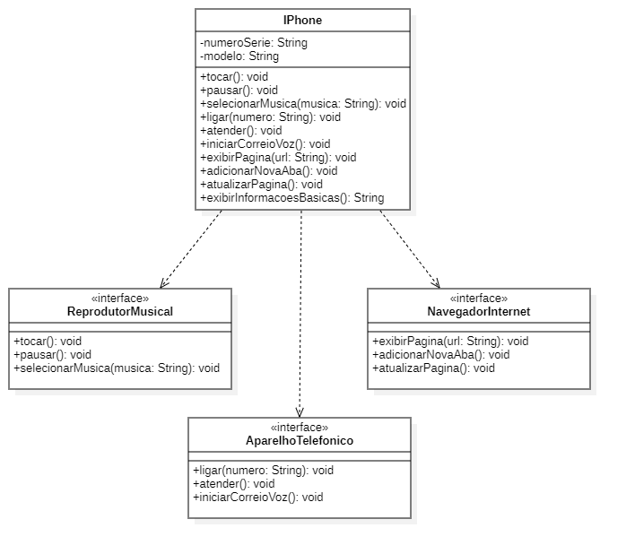

### Diagrama de Classes | Funcionalidades básicas iPhone 

#### Diagrama feito no StarUML

* A modelagem acima contempla as funcionalidades básicas implementadas no iPhone que fizeram do aparelho um marco na indústria tecnológica.
* Foram utilizadas três interfaces, para abstrair as funcionalidades de cada um dos recursos.